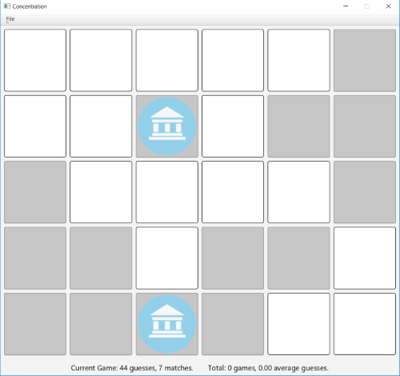

##Concentration

Concentration is a game of matching. It involves turing over two tiles
and matching them to eachother otherwise they are reset to their original
position.

In this game there are 30 tiles and 15 pairs. It keeps track of how many guesses
have been made and how many matches the user has made. It also keeps track of how many
games have been played and the average amount of guesses for each game
played in a single sitting.

To start a new game you must select so from the pulldown menu under File.

After every game finishes an alert box will open and ask if you would like
to play again. Yes will start a new game, no quits the game, and cancel
closes the menu.